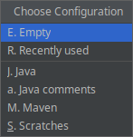

 

# IntelliJ Find In Path Configs (Plugin)

     
IntelliJ plugin for frequently used <em>Find In Path</em> configurations
 

## Features

- save your <em>Find In Path</em> configuration for later reuse (per project)
- predefined configurations for empty search and last used search

## Installation

- Using IDE built-in plugin system:

  <kbd>Settings</kbd> > <kbd>Plugins</kbd> > <kbd>Marketplace</kbd> >
  <kbd>Search for <em>Find In Path (Configurations)</em></kbd> > <kbd>Install Plugin</kbd>

## How to use

#### Create new configuration

Use <kbd>Ctrl+Shift+F</kbd> for standard <em>Find In Path action</em>, then respond to notification.
Click Save option, then fill name.

### Use previously saved configuration

Hit <kbd>Ctrl+Alt+Shift+F</kbd> then choose from list.

### Delete existing configuration

Hit <kbd>Ctrl+Alt+Shift+F</kbd> then select (move with arrows) to one from list and hit Delete key.

### Settings

There is currently no settings under **Settings | Tools**

### Reporting issues

If you experience bugs or weird behavior please create an issue
[on the bug tracker](https://github.com/Fuzy/IntelliJ-Find-In-Path-Configs/issues).
